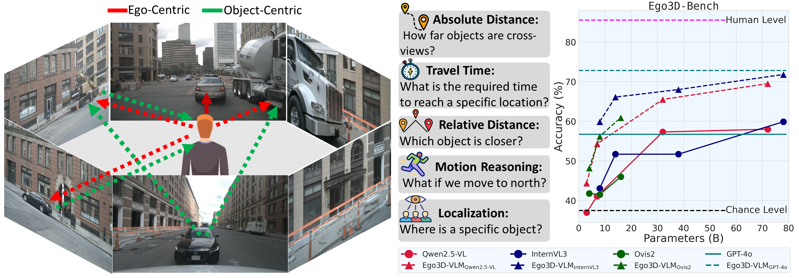
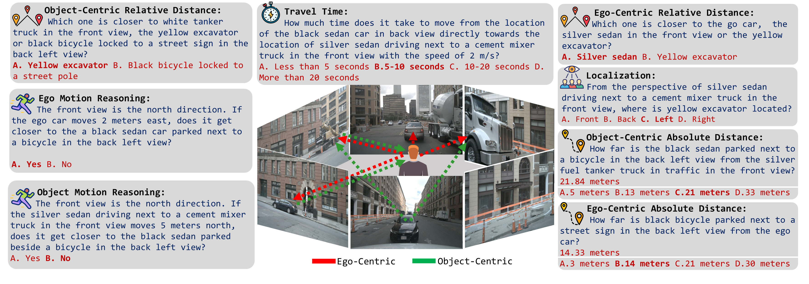
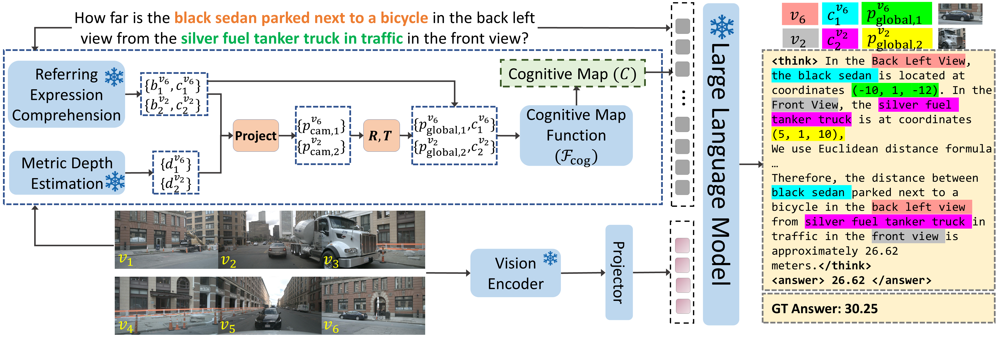
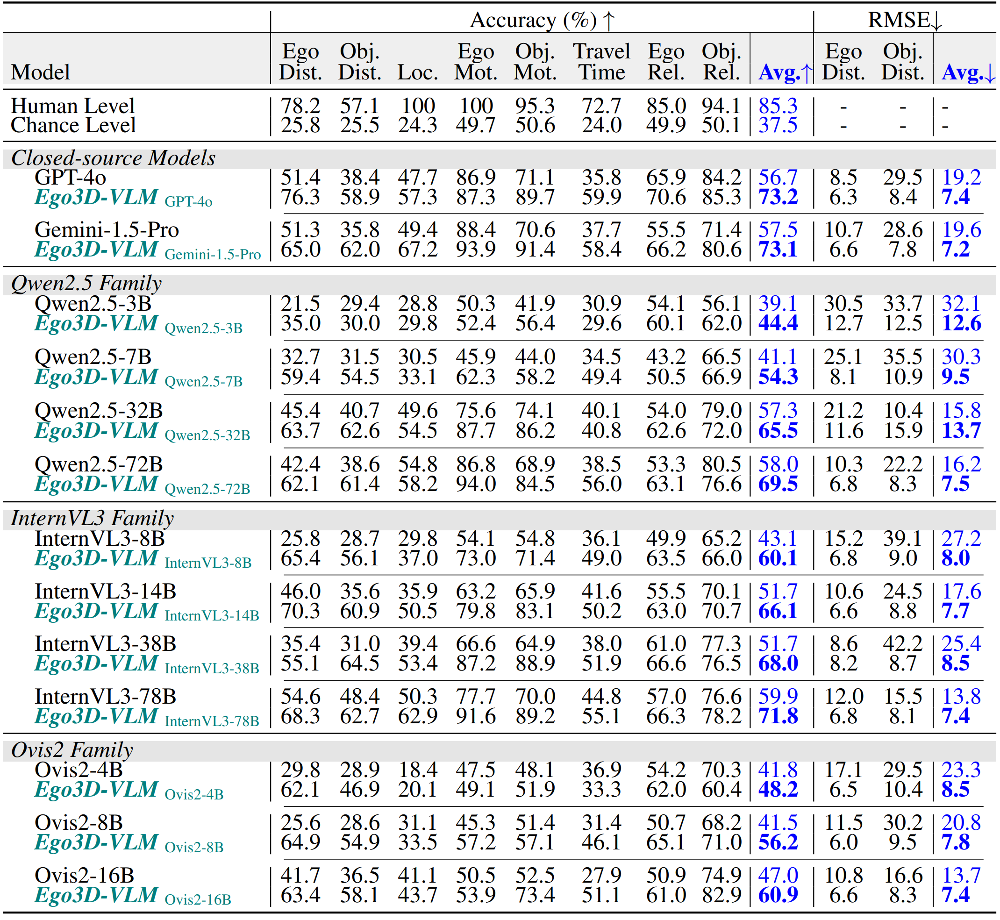

<div align="center">
  <h1>Spatial Reasoning with Vision-Language Models in Ego-Centric Multi-view Scenes</h1>
  <p><i>Benchmarking and Improving 3D Spatial Reasoning in Vision-Language Models</i></p>

<a href="https://arxiv.org/abs/2509.06266" target="_blank">
    
</a>
<a href="https://vbdi.github.io/Ego3D-Bench-webpage/" target="_blank">
    
</a>
<a href="https://huggingface.co/datasets/vbdai/Ego3D-Bench" target="_blank">
    
</a>
</div>

---


### 📌 Key Highlights
- 📊 **Ego3D-Bench**: A benchmark of **8,600+ human-verified QA pairs** for evaluating VLMs in **ego-centric, multi-view outdoor environments**.  
- 🧠 **Ego3D-VLM**: A **post-training framework** that builds cognitive maps from global 3D coordinates, achieving **+12% QA accuracy** and **+56% distance estimation** improvements.  
- 🚀 **Impact**: Together, Ego3D-Bench and Ego3D-VLM move VLMs closer to **human-level 3D spatial understanding** in real-world settings.  

---


### ⚖️ **Ego3D-Bench**
Benchmark Overview: We introduce Ego3D-Bench, a benchmark designed to evaluate the spatial understanding of VLMs in ego-centric multi-view scenarios. Images are collected from three different datasets: NuScenes, Argoverse, and Waymo. Questions are designed to require cross-view reseasoning. We define question from the ego-perspective and from the perspective of objects in the scene. To clearly indicate the perspective of each question, we categorize them into ego-centric or object-centric. In total we have 10 questions: 8 multi-choice QAs and 2 exact number QAs. Figure 



---
### 🧠 **Ego3D-VLM**
Ego3D-VLM is a post-training framework that enhances 3D spatial reasoning of VLMs. Ego3D-VLM generates cognitive map based on estimated global 3D coordinates of object in the input prompt and create a textual cognitive map baed on the input images and the question. This approach results in 12% average improvement on multi-choice QA and 56% average improvement on absolute distance estimation.


---
### 📊 **Results**


---

### 📌 Set-Up
#### Installation:

```
pip install torch==2.6.0 torchvision==0.21.0 torchaudio==2.6.0 --index-url https://download.pytorch.org/whl/cu124
pip install -r requirements.txt
``` 

Download the raw images of Ego3D-Bench from https://huggingface.co/datasets/vbdai/Ego3D-Bench and unzip the images in this directory ```Ego3D-Bench/images```

---
### 📌 Benchmarking on Ego3D-Bench:
We have scripts to benchmark internvl3 and Qwen2.5-vl families. Other families of models will be added soon! Give the path of baseline model as ```--model_path``` in the below scripts.
``` 
bash scripts/internvl3.sh
bash script/qwen_2.5_vl.sh
```

---

### 📌 Using Ego3D-VLM:
#### Downlaods: 
- Grounding-Dino: https://huggingface.co/IDEA-Research/grounding-dino-base
- DepthAnyThing-V2-Metric: https://huggingface.co/depth-anything/Depth-Anything-V2-Metric-Outdoor-Large-hf

We have scripts to use ego3dvlm alongwith internvl3 and Qwen2.5-vl families. Other families of models will be added soon! Add the path of grounding_dino checkpoint as ```--rec_model_path``` and the path of DepthAnyThing-V2-Metric as ```--depth_model_path```.

``` 
bash scripts/internvl3_ego3dvlm.sh
bash script/qwen_2.5_vl_ego3dvlm.sh
```

---

### Citation:
If you find our paper and code useful in your research, please consider giving us a star ⭐ and citing our work 📝 :)

```
@misc{gholami2025spatialreasoningvisionlanguagemodels,
      title={Spatial Reasoning with Vision-Language Models in Ego-Centric Multi-View Scenes}, 
      author={Mohsen Gholami and Ahmad Rezaei and Zhou Weimin and Sitong Mao and Shunbo Zhou and Yong Zhang and Mohammad Akbari},
      year={2025},
      eprint={2509.06266},
      archivePrefix={arXiv},
      primaryClass={cs.CV},
      url={https://arxiv.org/abs/2509.06266}, 
}
```

